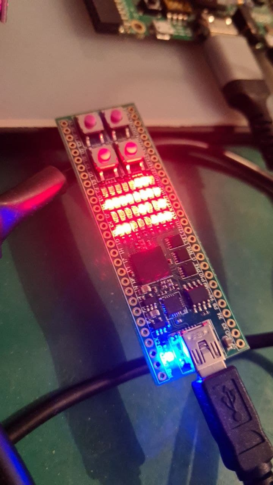

I know there are many variants of multipliers. To save area to fit on asics or fpgas. But I don't care. 
Just shift and add in one cycle and have long critical path and fun to torment your fpga

This is just for fun a single cycle with consuming much resources and doesn't care about target technology. 
Just implemented multiplication how we do calculation handwritten. 
The design is able to run >= 50 MHz on ice40hx8k according the synthesis tool.

